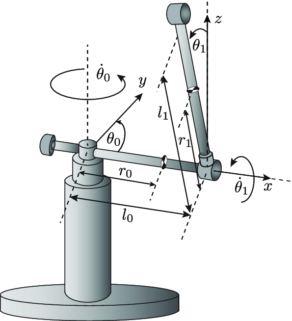
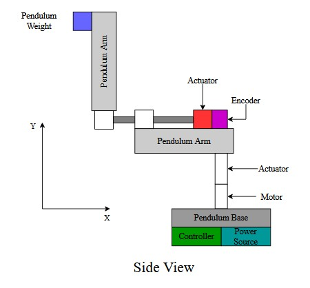
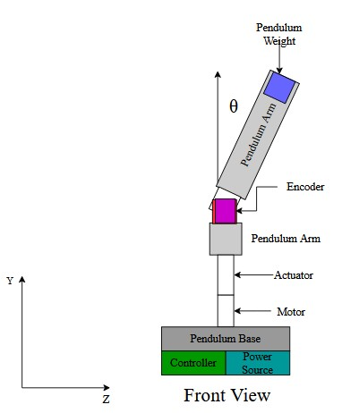
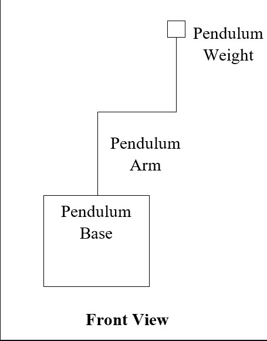
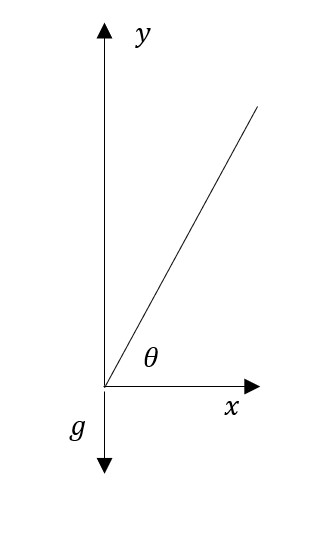
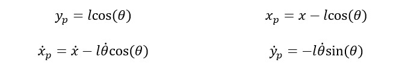
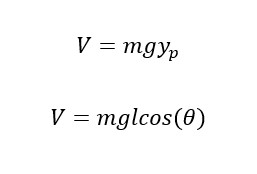
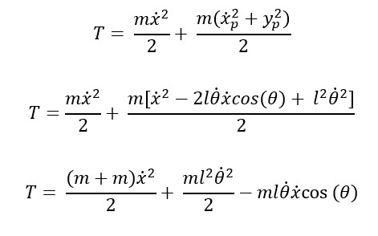
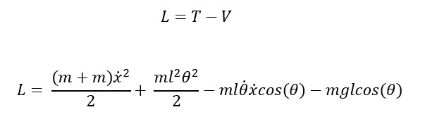

# MECA482-Teague-Singh
MECA 482 Control Systems Furuta Pendulum Project Github

**Group members**: 

- Aman Singh 

- Carson Teague

**Deliverables:**

- Create a self balancing pendulum Furuta Pendulum via Coppelia Sim and Matlab, Simulink or any other necessary software

- Create a mathematical model of the pendulum system

- Create a Github page with information on the project and all related files and visuals 

# Project Introduction
In this project, students will create a mathematical model for an inverted, self leveling Furuta Pendulum. This project will utilize multiple software programs that students have been educated on in several of their classes. Some of these software programs include Solidworks, Matlab, Coppelia Sim, and Simulink. 

&emsp;&emsp;&emsp;&emsp;&emsp;&emsp;&emsp;&emsp;&emsp;&emsp;&emsp;&emsp;&emsp;

# Furuta Pendulum Operational Viewpoint
Below are two operational viewpoints of the Furuta Pendulum design. These viewpoints illustrate the basic layout of the inividual components that make up this pendulum design.

&nbsp;&nbsp;&nbsp;&nbsp;&nbsp;&nbsp;&nbsp;&nbsp;&nbsp;&nbsp;&nbsp;&nbsp;&nbsp;&nbsp;&nbsp;&nbsp;&nbsp;&nbsp;&nbsp;&nbsp;&nbsp;&nbsp;&nbsp;&nbsp;&nbsp;&nbsp;&nbsp;&nbsp;&nbsp;&nbsp;&nbsp;&nbsp; 

# Mathematical Model
Shown below are visualizations of the Furuta Pendulum mathematical model. 

&nbsp;&nbsp;&nbsp;&nbsp;&nbsp;&nbsp;&nbsp;&nbsp;&nbsp;&nbsp;&nbsp;&nbsp;&nbsp;&nbsp;&nbsp;&nbsp;&nbsp;&nbsp;&nbsp;&nbsp;&nbsp;&nbsp;&nbsp;&nbsp;&nbsp;&nbsp;&nbsp;&nbsp;&nbsp;&nbsp;&nbsp;&nbsp;

Shown below are the motion equations.

Shown below are the partial derivations of the energy equations.

&emsp;&emsp;&nbsp;&nbsp;&nbsp;&nbsp;&nbsp;&nbsp; &emsp;&emsp;&emsp;&emsp;&emsp;&emsp;&emsp;&nbsp;&nbsp;&nbsp;&nbsp;&nbsp;&nbsp;&nbsp;&nbsp;&nbsp;&nbsp;&nbsp;&nbsp;&nbsp;  

&nbsp;&nbsp;&nbsp;&nbsp;&nbsp;&nbsp;

# Logic Diagram

# System Model

# Simulink Model

# Solidworks Model

# Conclusion
